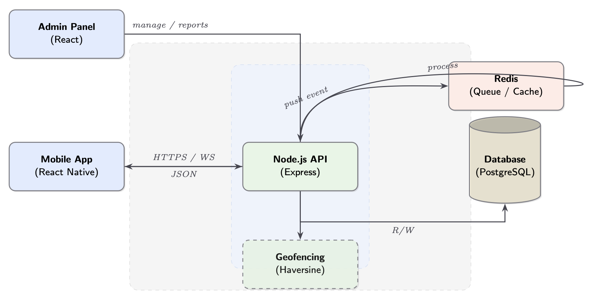
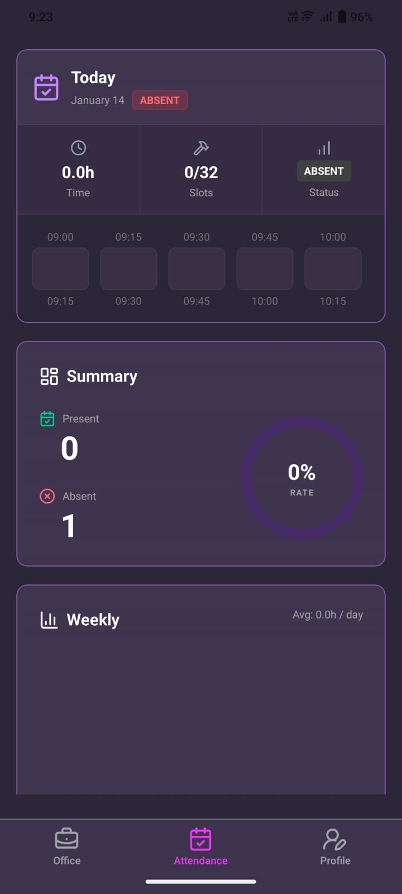
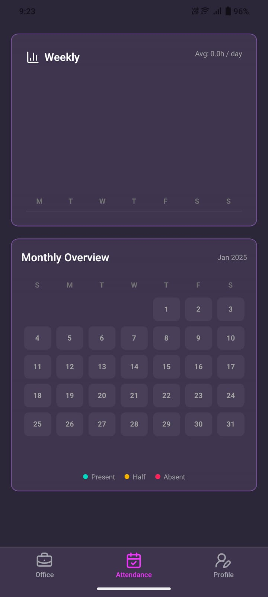
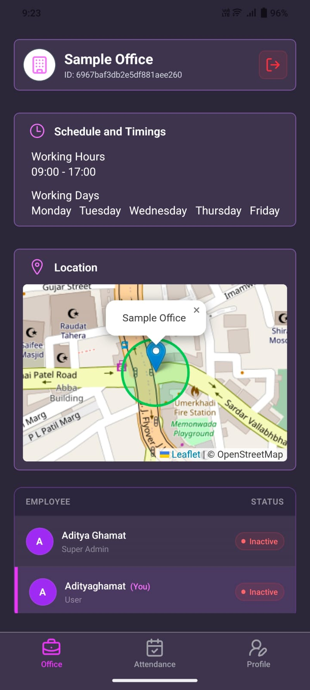
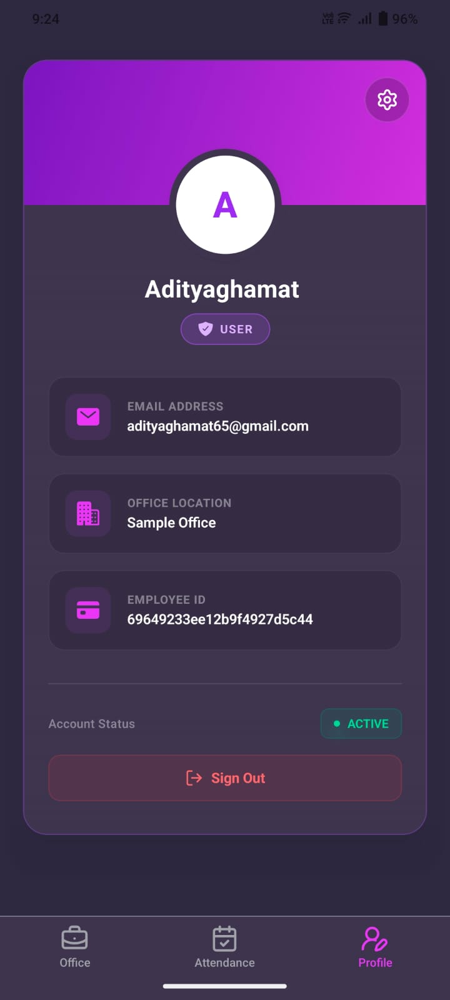
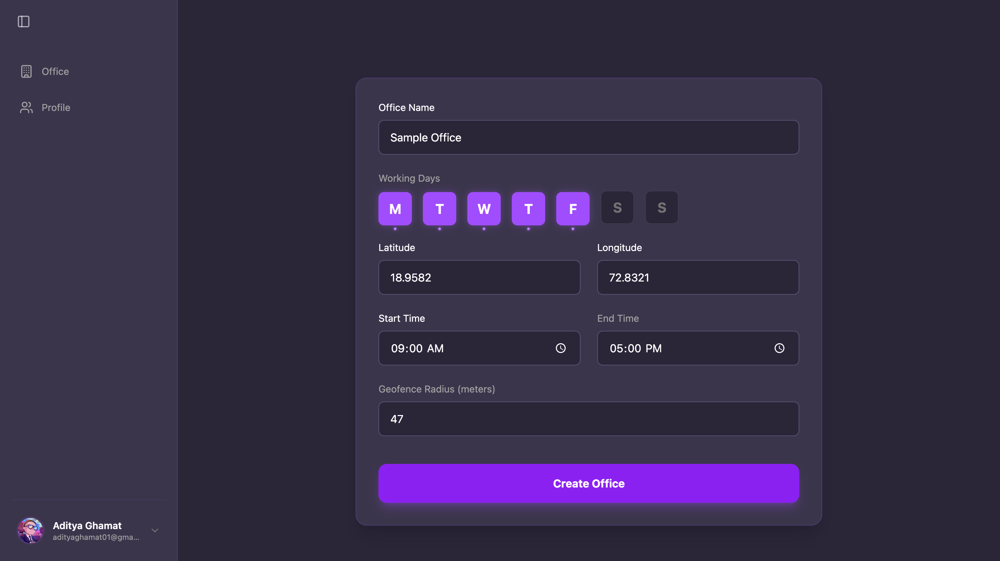
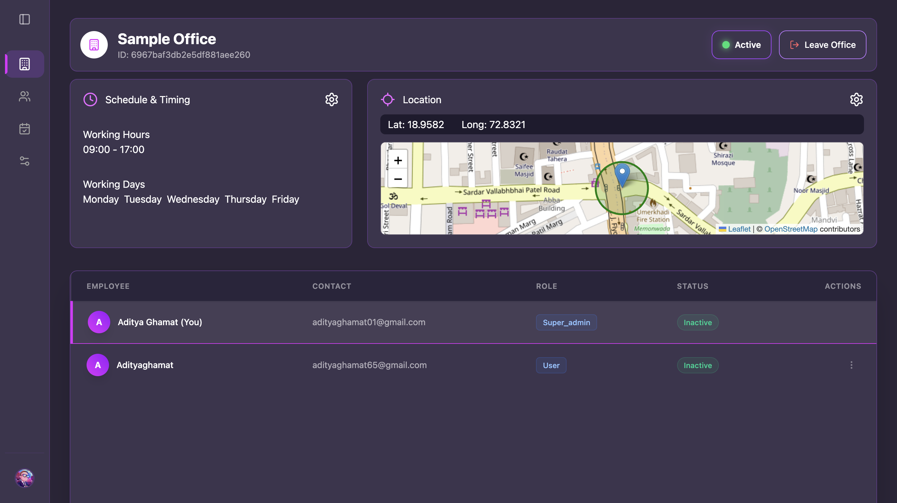
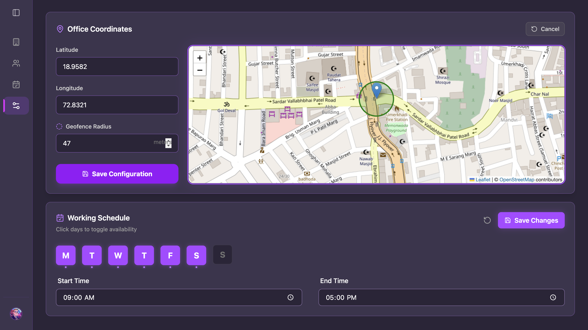

# Event-Driven Geofence Attendance Platform

      

## Overview

This project is a scalable, event-driven attendance management system designed to automate employee tracking using geofencing and real-time location telemetry. Unlike traditional synchronous systems, this platform utilizes an asynchronous architecture to handle high-throughput location updates without blocking the main application thread.

The system eliminates manual "punch-in" actions, relying instead on background location services and spatial validation to ensure accurate working hour calculation.

**Target Use Case:** Enterprise workforce management requiring high reliability, distributed processing, and location-based security.

---

## Key Features

- **Automated Tracking:** Zero-touch attendance logging based on device geolocation.
- **Event-Driven Architecture:** Decoupled services communicating via Redis streams/queues for horizontal scalability.
- **Geofence Validation:** Implementation of the Haversine formula to strictly enforce location boundaries.
- **Resiliency:** Background workers handle data aggregation, preventing API bottlenecks during peak hours.
- **Cross-Platform Support:** Monorepo structure supporting Web (Admin) and Mobile (Employee) interfaces.

---

## System Architecture



### Architectural Decisions & Trade-offs

| Decision                  | Context & Reasoning                                                                                                                                                                 |
| :------------------------ | :---------------------------------------------------------------------------------------------------------------------------------------------------------------------------------- |
| **Event-Driven vs. Cron** | Instead of running heavy synchronous jobs at the end of the day, location events are processed in real-time queues. This prevents database locks and allows for immediate feedback. |
| **Redis for Queues**      | Selected for its low latency and high throughput. Acts as the buffer between the high-frequency write operations (location updates) and the persistent storage (MongoDB).           |
| **Slot-Based Tracking**   | To handle network jitter and GPS drift, attendance is calculated in time "slots" rather than raw timestamps, ensuring fairer and more accurate total work hour computation.         |
| **Monorepo (Turborepo)**  | Ensures type safety is shared across the Backend, Frontend, and Mobile apps. A change in the API schema immediately flags type errors in the client applications.                   |

---

## Project Gallery

<details>
<summary>📸 <strong>Click to expand Interface Screenshots (7 Images)</strong></summary>
<br>

### Mobile App (Employee View)

|                              Dashboard (Top)                              |                              Dashboard (Scrolled)                              |                       Attendance History                       |                        Profile/Settings                         |
| :-----------------------------------------------------------------------: | :----------------------------------------------------------------------------: | :------------------------------------------------------------: | :-------------------------------------------------------------: |
|  |  |  |  |

<br>

### Admin Dashboard (Web View)

|                     Main Dashboard Overview                      |                        Employee Management                        |                    Reports & Analytics                    |
| :--------------------------------------------------------------: | :---------------------------------------------------------------: | :-------------------------------------------------------: |
|  |  |  |

</details>

---

## Technical Workflow

The system operates on a producer-consumer model to handle attendance data flow:

1.  **Ingestion:** The **Mobile Application** (React Native) runs a background service that transmits encrypted location coordinates to the API at set intervals.
2.  **Buffering:** The **Node.js API** receives the payload, performs basic schema validation, and immediately publishes a `location_update` event to the **Redis** bus. The API sends a 200 OK immediately to minimize client battery usage.
3.  **Processing (Worker Service):**
    - A subscribed background worker consumes the event.
    - **Geofencing:** The worker calculates the distance between the user and their assigned office using the **Haversine formula**.
    - **Logic Check:** If the user is within the radius AND inside working hours, an attendance slot is marked "Active".
4.  **Aggregation:** Scheduled aggregation jobs summarize daily slots into total working hours, updating the **MongoDB** daily records.
5.  **Reporting:** The **Admin Panel** queries these aggregated records to visualize attendance trends and export payroll reports.

---

## Technology Stack

### Core Infrastructure

- **Runtime:** Node.js (v18+)
- **Language:** TypeScript (Strict Mode)
- **Orchestration:** Docker & Docker Compose
- **Build System:** Turborepo

### Backend Services

- **Framework:** Express.js
- **Database:** MongoDB (Mongoose ODM)
- **Message Broker / Caching:** Redis
- **Validation:** Zod

### Client Applications

- **Web Dashboard:** React, Vite, TailwindCSS
- **Mobile App:** React Native, Expo, Background Location API

---

## Project Structure

This project uses a Monorepo structure to manage shared dependencies and configurations.

```txt
.
├── apps
│   ├── backend          # Node.js + Express Event API & Workers
│   ├── frontend         # React Admin Dashboard
│   └── mobile           # React Native Employee App
│
├── packages
│   ├── ts-config        # Shared TypeScript configurations
│   └── types            # Shared Zod schemas and TypeScript interfaces
│
├── compose.yaml         # Container orchestration
└── turbo.json           # Build pipeline configuration
```

````

---

## Getting Started

### Prerequisites

- Node.js >= 20
- Docker Desktop or CLI
- npm or pnpm

### Local Development Setup

1. **Install Dependencies**

```bash
npm install

```

2. **Environment Variables**
   Copy the example environment file and update the values.

```bash
cp .env.example .env

```

3. **Start Infrastructure (Redis & MongoDB)**

```bash
docker compose up -d

```

4. **Run Development Servers**
   Uses Turborepo to launch all apps in parallel.

```bash
npm run dev

```

### Service Specific Commands

If you wish to run services individually:

```bash
# Backend (API + Workers)
cd apps/backend && npm run dev

# Admin Panel (localhost:5173)
cd apps/frontend && npm run dev

# Mobile App (Expo Go)
cd apps/mobile && npx expo start

```

---

## Author

**Aditya Ghamat**

- [LinkedIn](https://www.linkedin.com/in/aditya-ghamat-14b558292/)
- [GitHub](https://github.com/AdityaGhamat)
- [Resume](https://drive.google.com/file/d/1atL-y0_pE2BBAPPA8jxkmP982FG9sWx0/view%3Fusp%3Dsharing)

```

```
````
